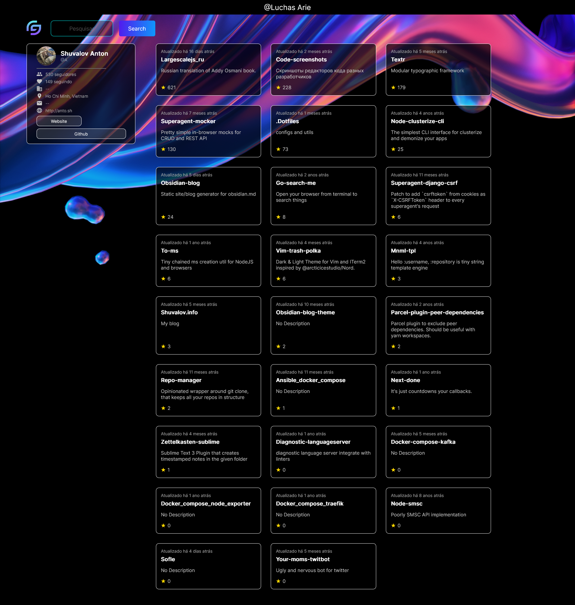

# Git_Find 2.0


Esse é um pequeno projeto criado pra um [desafio de vaga de desenvolvedor angular.](https://docs.google.com/document/d/1IXejML09nP0NTNW-VOGtgA_Lshrf4et8/edit?usp=sharing&ouid=111529386895483441891&rtpof=true&sd=true), e a continuação/Re-Design da [versão 1.0](https://github-info-finder-petize.web.app/results/wbond)

Você pode checar o projeto inicial de design pelo Figma também em [https://www.figma.com/file/xzeQUvHA2vnQm7yyB2awO3/GIT_FIND-2.0?node-id=0%3A1&t=fqMUOY82kbLzCnwM-1](https://www.figma.com/file/xzeQUvHA2vnQm7yyB2awO3/GIT_FIND-2.0?node-id=0%3A1&t=fqMUOY82kbLzCnwM-1)

Esse projeto foi feito com Angular versão 15.1.1

Uma versão live do aplicativo se encontra em [https://gitfind2.web.app/](https://gitfind2.web.app/)

## Mudanças

Essa versão, além de utilizar SCSS pra melhorar a usabilidade/reatividade do site, também é responsiva para uso em celulares. As ferramentas essenciais continuam as mesmas, utilizando-se de pipes feitos "a mão" pra acquisição e filtragem dos dados, além do básico de angular para display das informações adquiridas pela API 

## Instalação

Você pode usar o Git Find online pelo link [https://gitfind2.web.app/results/luchasarie](https://gitfind2.web.app/results/luchasarie)

### Plataforma e ferramentas

Você precisa instalar o Node.js e suas ferramentas. Node.js vem com um package manager chamado [npm](http://npmjs.org) pra installar aplicativos Node.js
* [Install node.js](http://nodejs.org/download/) (requires node.js version >= 0.8.4)


### Pegue o Código

Clone o repositório ou realize uma 'fork', e depois entre na pasta

```
git clone https://github.com/luchasarie/GitFind-2.0
cd GITFIND-2.0
```

## Serve

Use o comando abaixo para inicializar o cliente

```
npm start
```

## Acesso

[Depois é só abrir uma abra do seu navegador e acessar o endereço localhost:4200/](http://localhost:4200/)

### Sucesso!
